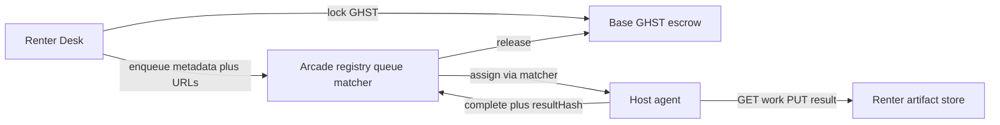
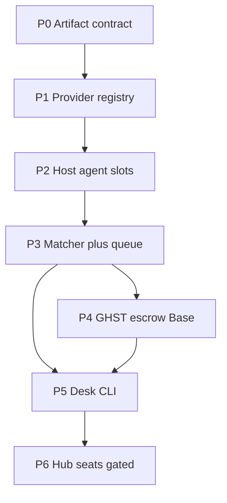

> **Status: PARKED for privacy (rented hosts see plaintext prompts).** Chats run on your own Hub — see [GOTCHIBOT-API.md](./GOTCHIBOT-API.md).

# Aarcade Host Network — build plan

**Status: LOCKED** with product doc [`AARCADE-HOST-NETWORK.md`](./AARCADE-HOST-NETWORK.md).

Canonical implementation plan for the mesh. Execute P0→P6 in order.

**Goal:** ship a **slots** marketplace — spare-CPU hosts earn GHST; renters pay GHST for bounded jobs; Arcade holds **metadata + escrow refs only**. Hub seats stay behind the gate checklist.

## Locked product decisions

| Decision | Choice |
|----------|--------|
| Network | Aarcade Host Network (not Akash/Spheron as community earn path) |
| CPU power | Community machines; Node host agent **manages**, work tools **compute** |
| SKUs | Hybrid: **slots** (v1) + **Hub seats** (gated P6) |
| Data | Arcade never stores chat/job bodies or Mongo URIs; BYO; Desk owns Atlas on rental |
| Stack | **BYO model** (OpenCode Go + work tools) + **BYO DB**; infra BYO or CaaS |
| Provider runtime | **Node.js** GotchiBot client |
| Protocol | MVP: Solidity escrow + off-chain Arcade coordination; later mesh Solidity on Base |
| Routing | **No classic load balancer** — P3 **matcher** + host **pull/claim** |
| Coordination (MVP) | Arcade registry / queue / matcher (centralized) |
| Settlement | GHST escrow on Base |
| Post-MVP matcher | **Claim-race** first (staked `claim()`); auction / multi-matcher later |

## Protocol surface

| Piece | MVP | Tech |
|-------|-----|------|
| Escrow | On-chain | **Solidity** — `GotchiBotHostEscrow` (Base / Base Sepolia) |
| Registry, queue, matcher | Off-chain | Arcade Node + Mongo |
| Host agent, Desk | Off-chain | GotchiBot JS |
| Post-MVP registry / intents / claim-race | On-chain (later) | **Solidity on Base** + off-chain **JS** heartbeat/agent chatter |

MVP builds a **Solidity money layer** + **off-chain coordination**. When we switch the mesh on-chain: **Solidity (Base) is the protocol language**; agents remain JS. Not CosmWasm / not a new L1.

## Architecture (slots MVP)



## Load balancing

**No nginx/ALB in front of providers.** Hosts are intermittent, often Tailscale/NAT; they pull work.

**P3 matcher instead:** assign to eligible `slots: true` hosts with fresh heartbeats and free capacity (prefer least-loaded / longest-idle). Host **claims**; Desk ↔ artifacts stay off Arcade. A web LB may later sit only in front of Arcade `www` APIs if QPS requires it — that is not Host Network routing.

## Decentralization posture

**Honest label:** decentralized **compute supply** + on-chain **GHST settlement**; **centralized coordination** (MVP).

| Layer | MVP | Who |
|-------|-----|-----|
| Machines / CPUs | Decentralized | Community hosts |
| Job bodies / chat | User-owned | Renter artifacts + BYO Atlas |
| GHST lock / payout | On-chain | Escrow contract |
| Registry, queue, matcher | Centralized | Arcade `www` + Mongo |

Not Akash-class trustless dePIN. Market as “community compute network paid in GHST,” not “fully decentralized.”

### Post-MVP: decentralize coordination

After slots MVP, ladder toward trustless coordination (hybrid: chain for truth, off-chain for heartbeats/chatter):

1. **Registry** — on-chain provider stake + attrs; signed off-chain heartbeats with periodic anchors; Mongo becomes cache  
2. **Queue** — on-chain job intents (hashes, price, expiry) + escrow tied to `jobId`; Arcade indexes  
3. **Matcher** — **claim-race**: first valid staked `claim()` wins (bonds + timeouts against griefing). Later: reverse auction and/or competing bonded matchers  
4. Shared needs: slash (no-show / fake complete), availability proofs, resultHash + dispute window, governance/`feeBps` not Arcade-admin-only  

## Build phases



### P0 — Slot job + artifact contract

| Field | Owner |
|-------|--------|
| `jobId`, renter ids, `status`, `providerId` | Arcade |
| `artifactPutUrl` / `artifactGetUrl` | **Renter** (Desk URL or presigned HTTPS) |
| `promptHash` / `resultHash` | Arcade (hashes only) |
| `maxCoreMinutes` / `priceGhstWei` | Arcade |

Statuses: `queued` → `assigned` → `running` → `done` | `failed`.

**Deliverables:** “Slot job record” section in product doc; `config/host-network.slot-job.schema.json`.

**Done when:** one JSON shape; Arcade never stores prompt text.

### P1 — Provider registry (Arcade API)

- `POST /api/gotchibot/host/register`
- `POST /api/gotchibot/host/heartbeat`
- `GET /api/gotchibot/host/me`
- `GET /api/gotchibot/host/list`

Store: `gotchibot_host_providers` (wallet, ads `{ slots, hubCapable, cpu, ramMb, diskGb }`, lastHeartbeat).  
Code: `AarcadeGh-t/lib/gotchibotHostNetwork.cjs` + www routes (mirror hub install-token patterns).

**Done when:** wallet registers, heartbeats, appears as `slots: true`.

### P2 — Host agent (GotchiBot)

**Provider install (slots):** clone/run GotchiBot — **Node.js**-powered JS host client (no custom binary, no Kubernetes).

```bash
./scripts/gotchibot host register …
./scripts/gotchibot host run
./scripts/gotchibot host status
```

Needs: Node, a wallet for GHST payouts, outbound HTTPS to Arcade + renter artifact URLs. Optional later: Docker sandbox for job isolation.

**Hub seats (P6):** same JS agent **plus** always-on Hub stack (Tailscale, OpenClaw, wipe) — not “client only.”

Flow: heartbeat → claim → fetch renter artifact → run in `sessions/host-jobs/<jobId>/` → PUT result → `resultHash` + done → wipe.  
Never `MONGODB_URI`; reject Hub seat work until P6.

**Done when:** one machine completes a fixture job E2E against Arcade staging.

### P3 — Matcher + queue (Arcade)

- `POST /api/gotchibot/slots/enqueue`
- `POST /api/gotchibot/slots/claim` / `complete`
- `GET /api/gotchibot/slots/:jobId` (no bodies)

Matcher: idle host + recent heartbeat + capacity fit.  
Every job needs a Base escrow lock (`--escrow-tx`); there is no no-chain mode.

**Done when:** enqueue → assign → claim → complete in SIM.

### P4 — GHST escrow (Base)

`GotchiBotHostEscrow`: `lockJob` / `release` / `refund` + `feeBps` treasury skim (License/Concierge GHST patterns).  
Prove on **Base Sepolia** before mainnet.

**Done when:** lock → release round-trip for one proven job id.

### P5 — Desk CLI

- `gotchibot slots submit|status`
- Pull via renter artifact get URL
- Local `opencode-dispatch` fallback when no hosts online

**Done when:** Desk can SIM/pay, wait, read artifact; Arcade never holds chat/job bodies.

### P6 — Hub seats (separate epic)

Only after checklist in [`AARCADE-HOST-NETWORK.md`](./AARCADE-HOST-NETWORK.md). Then: `hubCapable` + stake, lease GHST, write `hub.rental`, extend `scripts/hub.mjs` rental pin, wipe attestation before payout.

## Repo touch map

| Area | Repo |
|------|------|
| Docs, schemas, host CLI, Desk slots | GotchiBot |
| Registry, queue, APIs | AarcadeGh-t `lib/gotchibotHostNetwork.cjs` + routes |
| Escrow | AarcadeGh-t `contracts/` |
| Hub rental pin (P6) | GotchiBot `scripts/hub.mjs` + `gotchibotHub.cjs` |

## PR order

1. P0 schema + docs  
2. P1 registry  
3. P2 agent + P3 queue (SIM)  
4. P4 escrow  
5. P5 Desk  
6. P6 Hub seats epic  

## Out of scope (this build)

- Akash/Spheron as community earn path  
- Arcade Mongo for chat or job bodies  
- Public Hub seats before P6 gates  
- Long-lived secrets on provider hosts  
- Full on-chain heartbeats / decentralized matcher (post-MVP ladder only)

## Success metrics (slots MVP)

- ≥1 external host completes a Sepolia-escrowed (or SIM-then-Sepolia) slot job  
- Zero job prompt/result bodies in Arcade Mongo  
- Provider GHST payout observable on-chain  
- Hub seat product APIs remain gated  

## Implementation status (2026-09-24)

| Phase | Status |
|-------|--------|
| P0 schema + slot job doc | Done — `config/host-network.slot-job.schema.json` |
| P1 registry API | Done — `lib/gotchibotHostNetwork.cjs` + `api/gotchibot-host-network.js` |
| P2 host agent | Done — `scripts/host-network.mjs` (`gotchibot host …`); job runner is stub pending work-tool spawn |
| P3 queue + SIM | Done — enqueue/claim/complete + `sim` |
| P4 escrow Solidity | Contract written — `contracts/GotchiBotHostEscrow.sol` (deploy/wiring TBD) |
| P5 Desk CLI | Done — `gotchibot slots submit\|status` |
| P6 Hub seats | Deferred — gate checklist unchanged |
